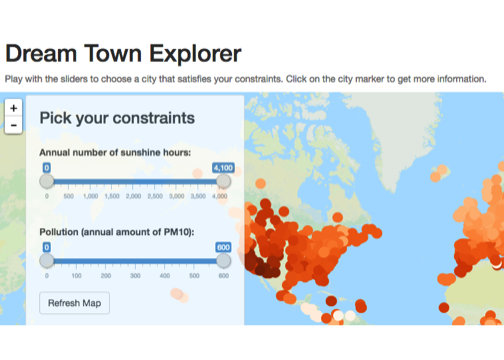

## Imagine...

<span style="font-style: italic;">
Imagine becoming a freelance Data Scientist and being able to work from anywhere 
in the world...
</span>


<span style="font-style: italic; float: right;">
...with thousands of beautiful locations on our planet, how do you choose the 
perfect one?
</span>

--- &twocol

## The Dreamtown App

I have created an [app](https://kabramova.shinyapps.io/dreamtown/) that lets you browse the world map and explore a variety of locations.

*** =left

<br>
You can play with the sliders to see only the locations that satisfy the following constraints:

- the annual amount of sunshine hours
- the level of air quality (specifed by the annual level of PM10 particles in the air)

*** =right



---

## The Dreamtown App

Additionally, whenever you click on a location, you can see a plot of sunshine
distribution over the whole year, like this one:

```r
yeardata <- readRDS("yeardata.Rds")
ylong <- melt(yeardata)
ggplot(ylong[ylong$Station.Name=='Sao Paulo',], aes(x=variable, y=value)) + geom_bar(stat="identity") + 
    xlab("Month") + ylab("Hours") + ggtitle("Sunshine hours by month in Sao Paulo, Brazil") + ylim(0, 450)
```


---

## Contributions and feature requests

<br>
If you want to contribute to the project, fork my github [repo](https://github.com/kabramova/dreamtown).

If you have suggestions on which constraints I should add to the app, please
post them [here](https://github.com/kabramova/dreamtown/issues/1).

<br>

<h5>Acknowledgements:</h5>
<br>
The data used in the project comes from [UN data](http://data.un.org/Data.aspx?d=CLINO&f=ElementCode%3a15), [World Meteorological Organization](http://www.wmo.int/pages/prog/www/ois/volume-a/vola-home.htm) and
[World Health Organization](http://www.who.int/gho/phe/outdoor_air_pollution/exposure/en/).


